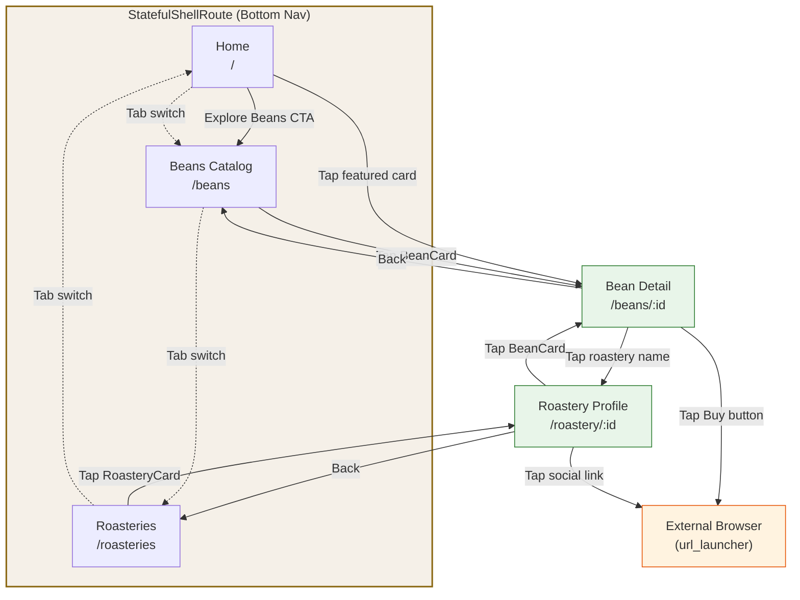
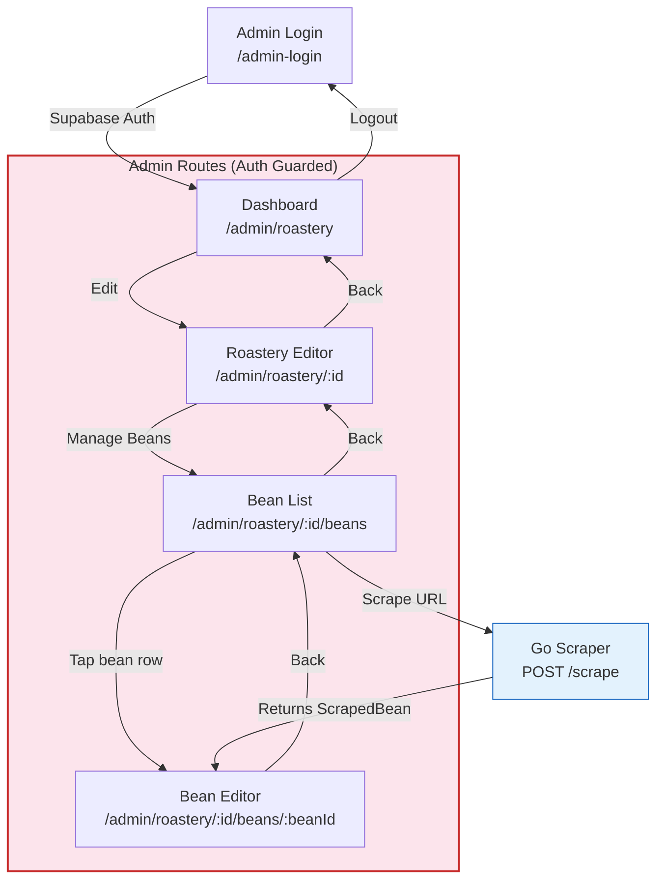
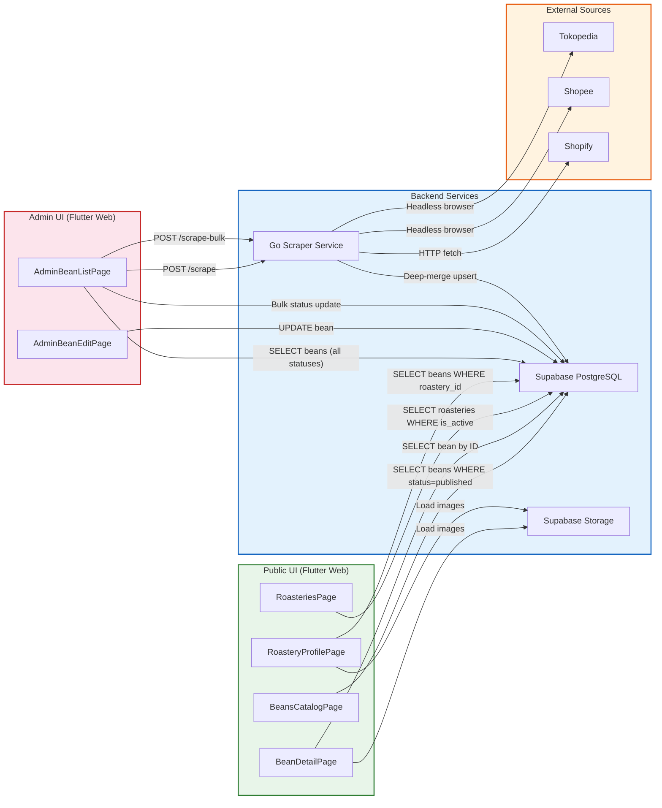
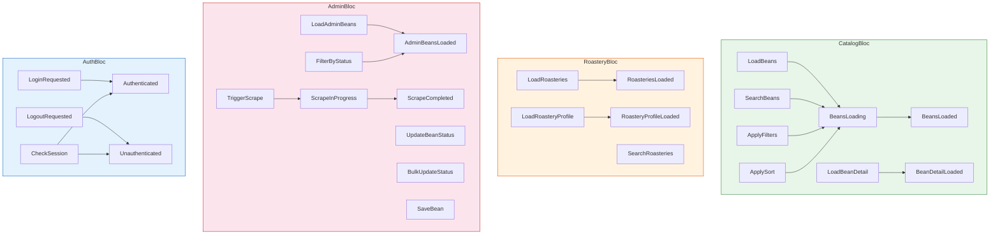
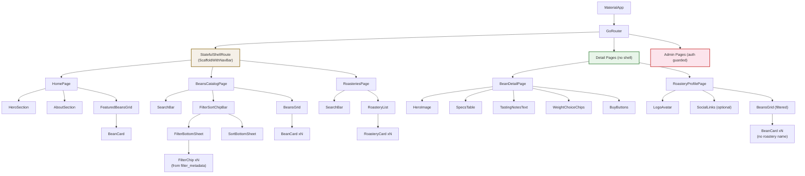
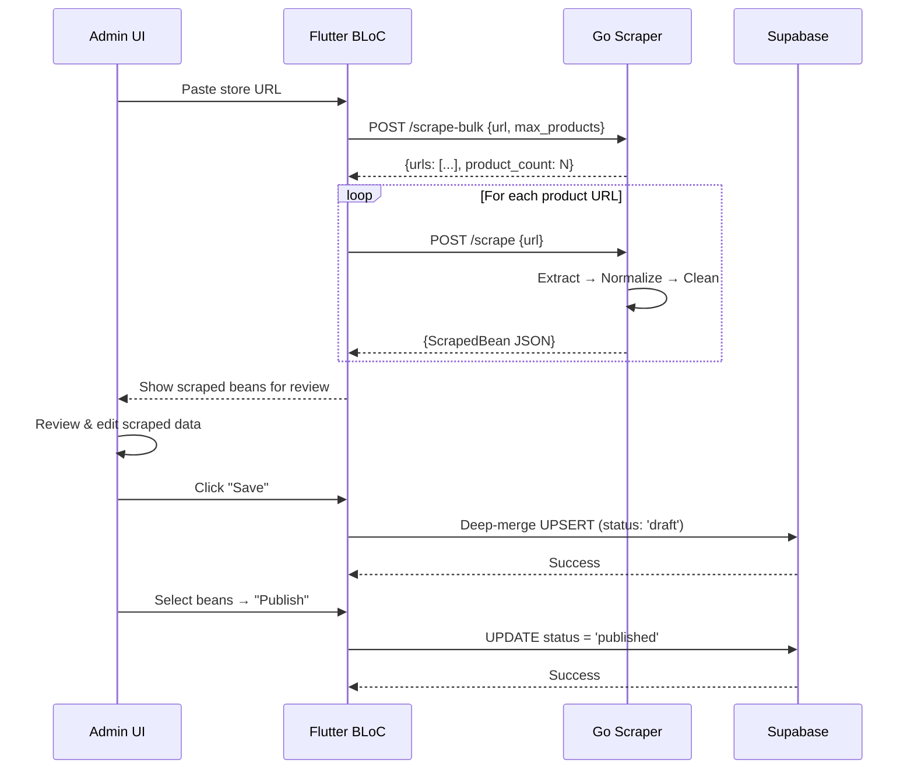
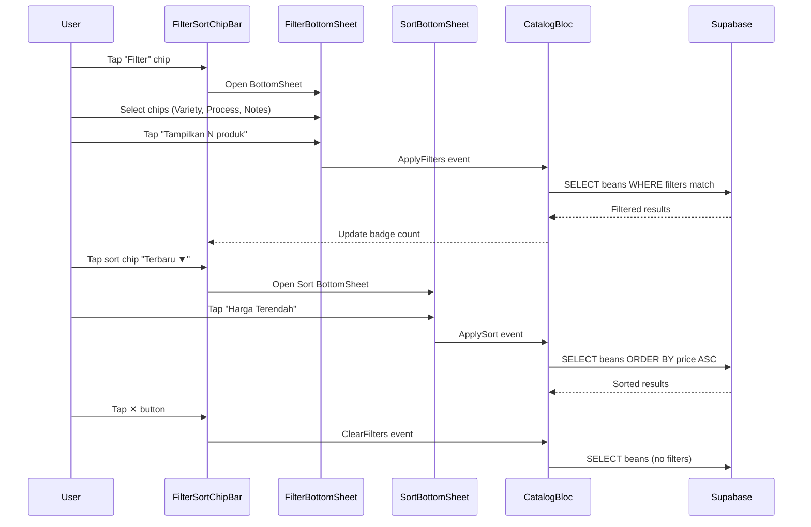

# ☕ Coffee Beans App — Frontend Implementation Plan

---

## 0. App Background & Context

> This section provides all the context needed to understand the app, its data, and its design intent — so any tool (including Stitch) or developer can produce accurate, realistic screens without needing external references.

### 0.1 What Is This App?

**Coffee Beans App** is a **mobile-first web platform** (MWeb) that aggregates and normalizes specialty coffee data from Indonesian roasteries and marketplaces (Tokopedia, Shopee, Shopify stores) into one **distraction-free catalog**.

- **App Name:** Coffee Beans
- **Tagline:** "Discover specialty coffee from Indonesia's finest roasteries"
- **Domain:** Specialty coffee discovery & comparison
- **Region Focus:** Indonesia (prices in IDR/Rupiah, Indonesian roastery names, Indonesian coffee origins)
- **Language:** Indonesian (Bahasa) for labels & UI copy, English for brand-level text
- **Platform:** Mobile Web (optimized for ~375px viewport, Flutter Web with CanvasKit/WASM)
- **Deployment:** Vercel (frontend), Supabase (database/auth/storage)

### 0.2 The Problem It Solves

Indonesian specialty coffee buyers currently face:
1. **Fragmented listings** across Tokopedia, Shopee, and direct roastery websites
2. **Noisy product titles** filled with promotional trash ("PROMO MURAH READY BIJI KOPI...")
3. **Duplicate entries** — the same bean sold as "250g" and "1kg" appears as separate products
4. **No unified filter/search** — can't filter by process method, origin, or tasting notes across marketplaces

**Coffee Beans App solves this** by:
- Scraping marketplace data with a Go-based engine
- Normalizing names, weights, and metadata
- Merging variants (250g, 500g, 1kg) under a single "master bean"
- Presenting everything in a clean, filterable catalog

### 0.3 Target Users

| Persona | Description | Key Actions |
|---|---|---|
| **Coffee Enthusiast** | Home brewer exploring new beans. Browses by flavor notes and origin. | Search → filter by notes → tap card → compare weights → buy on marketplace |
| **Casual Buyer** | Wants good coffee but doesn't know specialty terms. | Browse featured → tap interesting card → buy cheapest option |
| **Roastery Admin** | Manages their roastery's catalog on the platform. | Login → scrape store URL → review & edit → publish beans |

### 0.4 Key User Flows

**Flow 1: Discovery to Purchase** (3 taps)
```
Catalog (/beans) → Tap BeanCard → Bean Detail (/beans/:id) → Select weight → Tap "Buy on Tokopedia" → External browser
```

**Flow 2: Filter & Compare**
```
Catalog → Tap "Filter" → Select "Natural" process + "Fruity" notes → "Tampilkan 8 produk" → Browse filtered grid → Tap card
```

**Flow 3: Roastery Exploration**
```
Roasteries (/roasteries) → Search "Bandung" → Tap roastery card → View profile & beans → Tap bean → Detail page
```

**Flow 4: Admin Scraping**
```
Login → Dashboard → Select roastery → Paste Tokopedia store URL → Scrape → Review results → Edit metadata → Save as draft → Publish
```

### 0.5 Database Schema

#### `roasteries` Table
```sql
CREATE TABLE roasteries (
    id UUID PRIMARY KEY DEFAULT uuid_generate_v4(),
    name TEXT NOT NULL,
    city TEXT NOT NULL,
    bio TEXT,
    logo_url TEXT,
    social_links JSONB DEFAULT '{}'::jsonb,  -- Keys: instagram, tokopedia, shopee, web
    is_active BOOLEAN DEFAULT true
);
```

#### `beans` Table
```sql
CREATE TABLE beans (
    id UUID PRIMARY KEY DEFAULT uuid_generate_v4(),
    roastery_id UUID REFERENCES roasteries(id) ON DELETE CASCADE,
    clean_name TEXT NOT NULL,
    fingerprint TEXT UNIQUE NOT NULL,     -- roastery_id + slugify(clean_name)
    image_url TEXT,
    origin TEXT,                          -- e.g. "Java", "Ethiopia, Guji"
    process TEXT,                         -- e.g. "Washed", "Anaerobic Natural"
    roast_level TEXT,                     -- e.g. "Light", "Medium"
    altitude TEXT,                        -- e.g. "1500 masl"
    variety TEXT[] DEFAULT '{}',          -- e.g. ['Heirloom', 'Typica']
    notes TEXT[] DEFAULT '{}',            -- e.g. ['Citrus', 'Chocolate', 'Floral']
    status TEXT CHECK (status IN ('published', 'draft', 'unpublished')) DEFAULT 'draft',
    variants JSONB DEFAULT '{}'::jsonb   -- Keyed by weight string
);
```

#### `variants` JSONB Example
```json
{
  "100g": {
    "price": 96570,
    "buy_url": "https://www.tokopedia.com/fugolcoffee/kopi-arabika-watermelon-smash-100-gram",
    "marketplace": "tokopedia"
  },
  "250g": {
    "price": 185000,
    "buy_url": "https://www.tokopedia.com/fugolcoffee/kopi-arabika-watermelon-smash-250-gram",
    "marketplace": "tokopedia"
  },
  "1kg": {
    "price": 650000,
    "buy_url": "https://shopee.co.id/Kopi-Arabika-Watermelon-Smash-1kg",
    "marketplace": "shopee"
  }
}
```

#### `filter_metadata` Table (drives filter chips)
```sql
CREATE TABLE filter_metadata (
    id SERIAL PRIMARY KEY,
    category TEXT NOT NULL,   -- 'variety', 'process', 'origin', 'note'
    label TEXT NOT NULL,
    is_active BOOLEAN DEFAULT true
);
```

### 0.6 Sample Data (Realistic Content for Screens)

> Use this data to populate screens with realistic Indonesian specialty coffee content.

#### Sample Roasteries

| Name | City | Bio | Bean Count | Social Links |
|---|---|---|---|---|
| **Fugol Coffee** | Bandung | Small-batch specialty roasters crafting experimental processes since 2019. | 7 | instagram, tokopedia, web |
| **Initial Coffee** | Jakarta | Focused on single-origin Indonesian beans with exotic processing methods. | 12 | tokopedia, shopee |
| **Tanamera Coffee** | Jakarta | Premium roastery known for Sumatran and Javanese single-origins. | 18 | instagram, tokopedia, shopee, web |
| **Kopi Tuku** | Jakarta | Iconic Indonesian coffee brand with focus on accessibility. | 5 | instagram, web |
| **Jago Coffee** | Yogyakarta | Community-driven roastery specializing in Flores and Toraja beans. | 9 | instagram |
| **Simetri Coffee** | Bandung | Minimalist approach to light roasts and natural processes. | 11 | tokopedia, web |

#### Sample Beans

| Clean Name | Roastery | Origin | Process | Roast | Variety | Notes | Lowest Price | Weights |
|---|---|---|---|---|---|---|---|---|
| Watermelon Smash Natural | Fugol Coffee | Java | Anaerobic Natural | Light | Mix Variety | Berry, Strawberry, Watermelon, Melon, Orange | Rp 96.570 | 100g |
| Kerinci Lactic Natural | Fugol Coffee | Jambi | Lactic Natural | Medium | Sigarar Utang | Honeydew, Tropical, Stone Fruit | Rp 85.000 | 100g, 500g, 1kg |
| Ijen Pink Process | Initial Coffee | East Java | Pink Process | Light | Lini S | Rosehip, Strawberry, Champagne | Rp 145.000 | 200g, 1kg |
| Ijen Mosto | Initial Coffee | East Java | Mosto | Medium-Light | Lini S | Wine, Grape, Dark Cherry | Rp 162.000 | 200g |
| Ethiopia Guji Grade 1 | Tanamera Coffee | Ethiopia, Guji | Washed | Medium | Heirloom | Citrus, Chocolate, Floral | Rp 85.000 | 100g, 250g, 1kg |
| Aceh Gayo Honey | Tanamera Coffee | Aceh | Honey | Medium | Catimor, Bourbon | Caramel, Brown Sugar, Nutty | Rp 78.000 | 100g, 250g |
| Toraja Sapan | Jago Coffee | South Sulawesi | Full Wash | Medium-Dark | S795, Typica | Dark Chocolate, Tobacco, Earth | Rp 65.000 | 200g, 500g |
| Flores Bajawa | Jago Coffee | Flores | Natural | Medium | Typica, Jember | Red Fruit, Cacao, Spice | Rp 72.000 | 200g, 500g |
| Bali Kintamani | Simetri Coffee | Bali | Washed | Light | Typica | Stone Fruit, Jasmine, Clean | Rp 92.000 | 100g, 250g |
| Manggarai Anaerobic | Simetri Coffee | Flores | Anaerobic Natural | Light | Jember | Mango, Pineapple, Passion Fruit | Rp 115.000 | 100g, 200g |

#### Sample Filter Metadata (drives filter chips in UI)

| Category | Labels |
|---|---|
| **variety** | Heirloom, Typica, Bourbon, Catimor, Sigarar Utang, Lini S, S795, Jember, Mix Variety |
| **process** | Washed, Natural, Honey, Anaerobic Natural, Full Wash, Lactic Natural, Pink Process, Mosto |
| **note** | Citrus, Chocolate, Floral, Berry, Fruity, Nutty, Caramel, Tropical, Spice, Stone Fruit, Wine, Earth |
| **origin** | Java, Aceh, Flores, Bali, Toraja, Jambi, Ethiopia, Colombia |

#### Sample `social_links` JSONB

```json
// Fugol Coffee — has 3 links
{
  "instagram": "https://instagram.com/fugolcoffee",
  "tokopedia": "https://tokopedia.com/fugolcoffee",
  "web": "https://fugolcoffee.com"
}

// Kopi Tuku — has 2 links
{
  "instagram": "https://instagram.com/kopituku",
  "web": "https://kopituku.com"
}

// Jago Coffee — has only 1 link
{
  "instagram": "https://instagram.com/jagocoffee"
}

// Empty — no links at all
{}
```

### 0.7 Design System Tokens

#### Color Palette

| Token | Hex Value | Usage |
|---|---|---|
| `primary` | `#6F4E37` | Primary brown — buttons, active states, links |
| `primaryDark` | `#4A3428` | Dark variant — app bar, status bar tint |
| `primaryLight` | `#A0785C` | Light variant — hover, subtle backgrounds |
| `surface` | `#FBF8F4` | Main page background (warm off-white) |
| `surfaceCard` | `#FFFFFF` | Card backgrounds |
| `surfaceDark` | `#F5F0E8` | Secondary surfaces (filter sheet bg, dividers) |
| `onSurface` | `#1A1A1A` | Primary text color |
| `onSurfaceSecondary` | `#6B6B6B` | Secondary text (roastery name, metadata) |
| `onSurfaceTertiary` | `#9E9E9E` | Tertiary text (placeholder, disabled) |
| `accent` | `#2E7D32` | Success green — "published" badge, CTA |
| `accentChip` | `#E8F5E9` | Selected filter chip background |
| `accentChipBorder` | `#2E7D32` | Selected filter chip border |
| `chipDefault` | `#F5F5F5` | Unselected chip background |
| `chipDefaultBorder` | `#E0E0E0` | Unselected chip border |
| `error` | `#D32F2F` | Error states |
| `draft` | `#FF9800` | Draft status badge |
| `unpublished` | `#9E9E9E` | Unpublished status badge |
| `divider` | `#E8E8E8` | Divider lines |

#### Typography

| Style | Font | Size | Weight | Usage |
|---|---|---|---|---|
| `headlineLarge` | Inter | 24px | 700 (Bold) | Page titles, hero text |
| `headlineMedium` | Inter | 20px | 600 (SemiBold) | Section headers |
| `titleMedium` | Inter | 16px | 600 (SemiBold) | Card titles, bean names |
| `bodyLarge` | Inter | 16px | 400 (Regular) | Body text, descriptions |
| `bodyMedium` | Inter | 14px | 400 (Regular) | Secondary content, metadata |
| `bodySmall` | Inter | 12px | 400 (Regular) | Captions, timestamps |
| `labelLarge` | Inter | 14px | 500 (Medium) | Button labels, chip text |
| `labelSmall` | Inter | 11px | 500 (Medium) | Badge text, status labels |
| `priceText` | Inter | 16px | 700 (Bold) | Price display |

#### Spacing & Sizing

| Token | Value | Usage |
|---|---|---|
| `paddingPage` | 16px | Page-level horizontal padding |
| `paddingCard` | 12px | Card internal padding |
| `gapGrid` | 12px | Gap between grid items |
| `gapSection` | 24px | Gap between content sections |
| `radiusCard` | 12px | Card corner radius |
| `radiusChip` | 20px | Chip corner radius (pill shape) |
| `radiusButton` | 8px | Button corner radius |
| `radiusSheet` | 16px (top) | BottomSheet top corner radius |
| `elevationCard` | 2dp | Card shadow elevation |
| `minTouchTarget` | 48px | Minimum touch target size |
| `bottomNavHeight` | 56px | Bottom navigation bar height |
| `chipHeight` | 36px | Filter/sort chip height |
| `imageAspectRatio` | 1:1 | Bean card thumbnail ratio |

### 0.8 UI Copy & Content Guide

> Indonesian labels for the main UI — use these exact strings.

| Element | Indonesian (ID) | English Fallback |
|---|---|---|
| Bottom Nav Tab 1 | Home | Home |
| Bottom Nav Tab 2 | Beans | Beans |
| Bottom Nav Tab 3 | Roastery | Roastery |
| Search (Beans) | Cari beans... | Search beans... |
| Search (Roastery) | Cari nama atau kota... | Search by name or city... |
| Filter chip label | Filter | Filter |
| Sort: Default | Paling Sesuai | Most Relevant |
| Sort: Newest | Terbaru | Newest |
| Sort: Price High | Harga Tertinggi | Price High to Low |
| Sort: Price Low | Harga Terendah | Price Low to High |
| Sort: Most Viewed | Paling Banyak Dilihat | Most Viewed |
| Filter sheet title | Filter | Filter |
| Filter reset | Reset | Reset |
| Filter apply button | Tampilkan {N} produk | Show {N} products |
| Sort sheet title | Urutkan | Sort By |
| Product count | {N} Produk | {N} Products |
| Bean Detail: Specs | Spesifikasi | Specifications |
| Bean Detail: Notes | Tasting Notes | Tasting Notes |
| Bean Detail: Weight | Pilih Berat | Choose Weight |
| Bean Detail: Buy | Beli Dari | Buy From |
| Buy button: Tokopedia | Beli di Tokopedia | Buy on Tokopedia |
| Buy button: Shopee | Beli di Shopee | Buy on Shopee |
| Buy button: Website | Kunjungi Website | Visit Website |
| Home hero title | Coffee Beans | Coffee Beans |
| Home hero subtitle | Temukan kopi spesialti dari roasteri terbaik Indonesia | Discover specialty coffee from Indonesia's finest roasteries |
| Home CTA | Jelajahi Beans | Explore Beans |
| Home About title | Tentang Kami | About Us |
| Home About body | Kami mengumpulkan dan menyusun data kopi spesialti dari berbagai roasteri dan marketplace di Indonesia ke dalam satu katalog yang bersih dan mudah digunakan. | We aggregate and normalize specialty coffee data from Indonesian roasteries and marketplaces into one distraction-free catalog. |
| Home Featured | Beans Pilihan | Featured Beans |
| Roastery Profile: About | Tentang | About |
| Roastery Profile: Social | Tautan Sosial | Social Links |
| Roastery Profile: Beans section | Beans ({N}) | Beans ({N}) |
| Back button | Kembali | Back |
| Admin Login title | Admin | Admin |
| Admin Sign In | Masuk | Sign In |
| Admin Logout | Keluar | Logout |
| Admin Dashboard title | Dashboard Admin | Admin Dashboard |
| Admin Bean List: Scrape | Scrape | Scrape |
| Admin Publish | Publish | Publish |
| Admin Draft | Draft | Draft |
| Admin Unpublish | Unpublish | Unpublish |

### 0.9 Stitch Execution Guide

> Instructions for generating screens with [stitch.withgoogle.com](https://stitch.withgoogle.com)

**Project setup:**
- Create a Stitch project named **"Coffee Beans App"**
- Set device type to **MOBILE** (375px width viewport)
- Use **light mode** with surface color `#FBF8F4`

**Screen generation order** (recommended):
1. **Home Page** — hero + featured beans grid
2. **Beans Catalog** — search + chip bar + 2-column grid with BeanCards
3. **Filter BottomSheet** — sort chips + filter categories (Variety, Process, Notes)
4. **Sort BottomSheet** — simple list with checkmark
5. **Bean Detail** — hero image + specs table + notes text + weight chips + buy buttons
6. **Roastery Directory** — search + list of RoasteryCards
7. **Roastery Profile** — logo + bio + optional social links + bean grid
8. **Admin Login** — simple email/password form
9. **Admin Dashboard** — roastery list with search
10. **Admin Bean List** — status filter + scraper input + inventory with checkboxes
11. **Admin Bean Editor** — full editable form

**Key prompting notes for Stitch:**
- Always specify: "mobile viewport, 375px width, Inter font family"
- Reference the exact color tokens from Section 0.7
- Use the sample data from Section 0.6 to populate cards and lists
- BeanCards **never** show origin — only: image, name, roastery, notes (max 2 + overflow), price
- Tasting notes on detail page are **simple comma-separated text**, never chips or badges
- Social links on roastery profile are **optional** — conditionally rendered
- Filter/Sort UX follows **Tokopedia mobile web** pattern exactly (chip bar → BottomSheet)
- Bottom nav only on Home, Beans, Roastery tabs — hidden on all detail and admin pages
- All prices in **Indonesian Rupiah** format: "Rp XX.000" (dot as thousands separator)
- Chip selected state: green outline (`#2E7D32`) on light green bg (`#E8F5E9`)

---

## 1. UI/UX Philosophy

### Design Pillars

| Pillar | Description |
|---|---|
| **Distraction-Free** | No ads, no clutter. The bean is the hero. Clean cards, generous whitespace, and a muted earth-tone palette let the product imagery breathe. |
| **Mobile-First (MWeb)** | Every layout decision starts at ~375px viewport. Desktop is a stretch goal, not the primary target. Touch targets ≥ 48px, bottom-anchored navigation, swipe-friendly sheets. |
| **Zero-Friction Discovery** | Users land → search/filter → tap a card → pick a weight → buy. Three taps from catalog to checkout. |
| **Master-Variant Architecture** | One card per bean, regardless of how many weight/marketplace combos exist. Weight selection happens *inside* the detail page via choice-chips, not as separate listings. |

### Visual Language

| Token | Value | Rationale |
|---|---|---|
| Primary | Warm brown / coffee tones | Domain-appropriate, premium feel |
| Surface | Off-white / cream | Easy on the eyes for long browsing |
| Typography | Inter / Outfit (Google Fonts) | Modern, highly legible at small sizes |
| Corner Radius | 12–16px | Soft, friendly, mobile-native feel |
| Elevation | Subtle shadows (2–4dp) | Cards float gently above the surface |
| Imagery | Supabase Storage (1GB free) | ~3,300–5,000 images at 200–300KB each |

---

## 2. Navigation Architecture

### Core Concept: Shell + Detail Split

The app uses `go_router`'s `StatefulShellRoute` to create two navigation "layers":

1. **Shell Layer** — 3 tabs with a persistent `BottomNavigationBar`. Each tab preserves its own scroll position and state.
2. **Detail Layer** — Full-screen pages that *break out* of the shell (no bottom nav). User returns via a `Back` button.

### Router Tree

```
GoRouter
│
├─ StatefulShellRoute (BottomNavigationBar scaffold)
│  ├─ Branch 0: /              → HomePage
│  ├─ Branch 1: /beans         → BeansCatalogPage
│  └─ Branch 2: /roasteries    → RoasteriesPage
│
├─ /beans/:id                  → BeanDetailPage      (no shell)
├─ /roastery/:id               → RoasteryProfilePage (no shell)
│
├─ /admin-login                → AdminLoginPage       (no shell)
│
└─ ShellRoute (Admin scaffold — sidebar or top nav)
   ├─ /admin/roastery              → AdminDashboardPage
   ├─ /admin/roastery/:id          → AdminRoasteryEditPage
   ├─ /admin/roastery/:id/beans    → AdminBeanListPage
   └─ /admin/roastery/:id/beans/:beanId → AdminBeanEditPage
```

### Bottom Navigation Bar Visibility

| Page | Path | Bottom Nav? |
|---|---|---|
| Home | `/` | ✅ Yes |
| Beans Catalog | `/beans` | ✅ Yes |
| Roastery Directory | `/roasteries` | ✅ Yes |
| Bean Detail | `/beans/:id` | ❌ No |
| Roastery Profile | `/roastery/:id` | ❌ No |
| Admin (all) | `/admin/*` | ❌ No |

---

## 3. Screen Wireframes (ASCII)

### 3.1 Home — `/`

```
┌─────────────────────────────────────┐
│           Coffee Beans              │
│─────────────────────────────────────│
│                                     │
│  ┌─────────────────────────────────┐│
│  │                                 ││
│  │         Coffee Beans            ││
│  │                                 ││
│  │    Discover specialty coffee    ││
│  │    from Indonesia's finest      ││
│  │    roasteries                   ││
│  │                                 ││
│  │        [ Explore Beans ]        ││
│  │                                 ││
│  └─────────────────────────────────┘│
│                                     │
│  ── About ──────────────────────── │
│                                     │
│  We aggregate and normalize         │
│  specialty coffee data from         │
│  Indonesian roasteries &            │
│  marketplaces into one              │
│  distraction-free catalog.          │
│                                     │
│  ── Featured Beans ────────────── │
│                                     │
│  ┌───────────────┐ ┌───────────────┐│
│  │ ┌───────────┐ │ │ ┌───────────┐ ││
│  │ │           │ │ │ │           │ ││
│  │ │    IMG    │ │ │ │    IMG    │ ││
│  │ │           │ │ │ │           │ ││
│  │ └───────────┘ │ │ └───────────┘ ││
│  │ Ethiopia Guji │ │ Aceh Gayo     ││
│  │ Roastery A    │ │ Roastery B    ││
│  │ Citrus, Choc  │ │ Natural, Nut  ││
│  │ Rp 85.000     │ │ Rp 120.000    ││
│  └───────────────┘ └───────────────┘│
│                                     │
│─────────────────────────────────────│
│  [Home]    Beans    Roastery        │
│  ━━━━                               │
└─────────────────────────────────────┘
```

**UX Notes:**
- Header shows app name/logo only — no hamburger or menu icon
- Hero section with a CTA button that navigates to `/beans`
- "About" is a brief mission statement (2-3 sentences)
- "Featured Beans" shows a horizontal-scrolling or 2-column grid of editorially picked `published` beans
- Bottom nav labels are text-only (no emoji icons), Home tab is active (underline indicator)
- BeanCard shows: name, roastery, tasting notes (max 2), price — all text, no icons
- **No origin line** on BeanCard

---

### 3.2 Beans Catalog — `/beans`

> **Filter & Sort UX follows the Tokopedia mobile web pattern.**

#### Main Catalog Page

```
┌─────────────────────────────────────┐
│              Beans                  │
│─────────────────────────────────────│
│  ┌─────────────────────────────────┐│
│  │ Search beans...                  ││
│  └─────────────────────────────────┘│
│                                     │
│  ┌──┐ ┌────────┐ ┌────────── ▼┐    │
│  │✕ │ │ Filter │ │ Terbaru    │ ...│
│  └──┘ └────────┘ └────────────┘    │
│                                     │
│  24 Produk                          │
│                                     │
│  ┌───────────────┐ ┌───────────────┐│
│  │ ┌───────────┐ │ │ ┌───────────┐ ││
│  │ │           │ │ │ │           │ ││
│  │ │    IMG    │ │ │ │    IMG    │ ││
│  │ │           │ │ │ │           │ ││
│  │ └───────────┘ │ │ └───────────┘ ││
│  │ Ethiopia Guji │ │ Aceh Gayo     ││
│  │ Roastery A    │ │ Roastery B    ││
│  │ Citrus, Choc  │ │ Natural, +3   ││
│  │ Rp 85.000     │ │ Rp 120.000    ││
│  └───────────────┘ └───────────────┘│
│  ┌───────────────┐ ┌───────────────┐│
│  │ ┌───────────┐ │ │ ┌───────────┐ ││
│  │ │    IMG    │ │ │ │    IMG    │ ││
│  │ └───────────┘ │ │ └───────────┘ ││
│  │ Toraja Sapan  │ │ Bali Kintam.  ││
│  │ Roastery C    │ │ Roastery D    ││
│  │ Honey, Fruit  │ │ Floral, +1    ││
│  │ Rp 95.000     │ │ Rp 78.000     ││
│  └───────────────┘ └───────────────┘│
│               ...                   │
│─────────────────────────────────────│
│  Home      [Beans]    Roastery      │
│            ━━━━━━                    │
└─────────────────────────────────────┘
```

#### Filter BottomSheet (Tokopedia-style)

Tapping the "Filter" chip opens a BottomSheet:

```
┌─────────────────────────────────────┐
│           ── (drag handle) ──       │
│                                     │
│  Filter                      Reset  │
│                                     │
│  ── Urutkan ───────────────────── │
│                                     │
│  ┌───────────┐ ┌───────┐ ┌───────┐ │
│  │Paling     │ │Terbaru│ │Harga  │ │
│  │Sesuai     │ │       │ │Tinggi │ │
│  └───────────┘ └───────┘ └───────┘ │
│  ┌───────────┐ ┌───────────────┐   │
│  │ Harga     │ │[Paling Banyak]│   │
│  │ Rendah    │ │  Dilihat      │   │
│  └───────────┘ └───────────────┘   │
│                                     │
│  ── Variety ───────────────────── │
│                                     │
│  ┌────────┐ ┌──────┐ ┌──────────┐  │
│  │Heirloom│ │Typica│ │  Bourbon │  │
│  └────────┘ └──────┘ └──────────┘  │
│  ┌──────────────┐ ┌────────────┐   │
│  │Catimor       │ │ Lainnya... │   │
│  └──────────────┘ └────────────┘   │
│                                     │
│  ── Process ───────────────────── │
│                                     │
│  ┌───────┐ ┌────────┐ ┌─────────┐  │
│  │Washed │ │Natural │ │  Honey  │  │
│  └───────┘ └────────┘ └─────────┘  │
│  ┌──────────────────┐              │
│  │ Anaerobic Natural│              │
│  └──────────────────┘              │
│                                     │
│  ── Notes ─────────────────────── │
│                                     │
│  ┌──────┐ ┌──────────┐ ┌────────┐  │
│  │Citrus│ │Chocolate │ │ Fruity │  │
│  └──────┘ └──────────┘ └────────┘  │
│  ┌──────┐ ┌──────┐ ┌──────────┐   │
│  │Berry │ │Nutty │ │ Lainnya..│   │
│  └──────┘ └──────┘ └──────────┘   │
│                                     │
│  ┌─────────────────────────────────┐│
│  │      Tampilkan 24 produk        ││
│  └─────────────────────────────────┘│
└─────────────────────────────────────┘
```

#### Sort BottomSheet

Tapping the sort chip (e.g., "Terbaru ▼") opens a separate BottomSheet:

```
┌─────────────────────────────────────┐
│                                     │
│  ✕  Urutkan                        │
│                                     │
│  ─────────────────────────────────  │
│  Paling Sesuai                      │
│  ─────────────────────────────────  │
│  Terbaru                      ✓    │
│  ─────────────────────────────────  │
│  Harga Tertinggi                    │
│  ─────────────────────────────────  │
│  Harga Terendah                     │
│  ─────────────────────────────────  │
│  Paling Banyak Dilihat              │
│  ─────────────────────────────────  │
│                                     │
│                                     │
└─────────────────────────────────────┘
```

**UX Notes (Tokopedia pattern):**
- Below the search bar: a **horizontal scrollable chip bar** with:
  - `✕` button (clears all active filters)
  - `Filter` chip (opens Filter BottomSheet)
  - Sort dropdown chip showing current sort label + `▼` (opens Sort BottomSheet)
- **Filter BottomSheet** (slides up from bottom, ~80% screen height):
  - Title "Filter" with "Reset" link on the right
  - Sort options inside the filter as wrap chips (Tokopedia-style)
  - Filter categories as sections: **Variety**, **Process**, **Notes** — each with wrap chips from `filter_metadata` table
  - Active chips are highlighted (green outline, like Tokopedia)
  - Sticky bottom button: "Tampilkan N produk" (Show N products)
- **Sort BottomSheet** (smaller, slides from bottom):
  - Title "Urutkan" with `✕` close button
  - List of sort options with checkmark on selected
  - Options: Paling Sesuai, Terbaru, Harga Tertinggi, Harga Terendah, Paling Banyak Dilihat
- **Chip bar** shows active filter count badge on Filter chip (e.g., "1 Filter")
- **Product count** shown below chip bar (e.g., "24 Produk")
- **Grid** is 2-column `GridView` of `BeanCard` widgets
- **BeanCard content**: name, roastery, tasting notes (max 2 shown, "+N" overflow), price — all text, no icons, **no origin**
- Price shown is the **lowest variant price** (e.g., smallest weight)
- Infinite scroll / pagination from Supabase
- RLS ensures only `status = 'published'` beans are returned

---

### 3.3 Roastery Directory — `/roasteries`

```
┌─────────────────────────────────────┐
│            Roasteries               │
│─────────────────────────────────────│
│  ┌─────────────────────────────────┐│
│  │ Search by name or city...        ││
│  └─────────────────────────────────┘│
│                                     │
│  ┌─────────────────────────────────┐│
│  │ ┌─────┐                         ││
│  │ │     │  Roastery A              ││
│  │ │Logo │  Jakarta                 ││
│  │ │     │  12 beans                ││
│  │ └─────┘                         ││
│  └─────────────────────────────────┘│
│  ┌─────────────────────────────────┐│
│  │ ┌─────┐                         ││
│  │ │     │  Roastery B              ││
│  │ │Logo │  Bandung                 ││
│  │ │     │  8 beans                 ││
│  │ └─────┘                         ││
│  └─────────────────────────────────┘│
│  ┌─────────────────────────────────┐│
│  │ ┌─────┐                         ││
│  │ │     │  Roastery C              ││
│  │ │Logo │  Yogyakarta              ││
│  │ │     │  15 beans                ││
│  │ └─────┘                         ││
│  └─────────────────────────────────┘│
│               ...                   │
│─────────────────────────────────────│
│  Home      Beans    [Roastery]      │
│                     ━━━━━━━━━       │
└─────────────────────────────────────┘
```

**UX Notes:**
- `ListView` layout (not grid — each roastery gets a full-width card)
- Each card: logo thumbnail (left) + name, city, bean count (right) — all text, no icons
- Search filters by `name` or `city` (client-side or Supabase `ilike`)
- Tapping a card → navigates to `/roastery/:id`
- Only `is_active = true` roasteries shown

---

### 3.4 Bean Detail — `/beans/:id`

```
┌─────────────────────────────────────┐
│  Back                               │
│─────────────────────────────────────│
│  ┌─────────────────────────────────┐│
│  │                                 ││
│  │                                 ││
│  │           Bean Image            ││
│  │            (hero)               ││
│  │                                 ││
│  │                                 ││
│  └─────────────────────────────────┘│
│                                     │
│  Ethiopia Guji Grade 1              │
│  by Roastery A                      │
│                                     │
│  ── Specs ──────────────────────── │
│                                     │
│  Origin     Ethiopia, Guji          │
│  Process    Washed                  │
│  Variety    Heirloom                │
│  Roast      Medium                  │
│  Altitude   1,800 - 2,100 masl     │
│                                     │
│  ── Tasting Notes ─────────────── │
│                                     │
│  Citrus, Chocolate, Floral          │
│                                     │
│  ── Weight ────────────────────── │
│                                     │
│  ┌───────┐ ┌───────┐ ┌───────┐     │
│  │[100g] │ │ 200g  │ │  1kg  │     │
│  └───────┘ └───────┘ └───────┘     │
│   selected                          │
│                                     │
│  Price: Rp 85.000                   │
│                                     │
│  ── Buy From ──────────────────── │
│                                     │
│  ┌─────────────────────────────────┐│
│  │  Buy on Tokopedia             → ││
│  └─────────────────────────────────┘│
│  ┌─────────────────────────────────┐│
│  │  Buy on Shopee                → ││
│  └─────────────────────────────────┘│
│  ┌─────────────────────────────────┐│
│  │  Visit Website                → ││
│  └─────────────────────────────────┘│
│                                     │
│              (no bottom nav)        │
└─────────────────────────────────────┘
```

**UX Notes:**
- **No bottom nav** — this is a detail page outside the shell
- `Back` returns to previous page (preserving scroll position)
- **Hero image** from Supabase Storage (`image_url`)
- **"by Roastery A"** is tappable text, navigates to `/roastery/:id`
- **Specs** rendered as a key-value table from bean fields — all plain text
- **Tasting Notes** rendered as **simple comma-separated text** — no chips, no cards, no icons
- **Weight Choice-Chips** — driven by keys in `variants` JSONB:
  - Selecting a chip updates price and buy links dynamically
  - Default selection: first/smallest weight
- **Buy buttons** — text-only labels, each marketplace link opens via `url_launcher` (external browser)

---

### 3.5 Roastery Profile — `/roastery/:id`

```
┌─────────────────────────────────────┐
│  Back                               │
│─────────────────────────────────────│
│                                     │
│           ┌─────────┐              │
│           │         │              │
│           │  Logo   │              │
│           │         │              │
│           └─────────┘              │
│         Roastery Name A             │
│         Jakarta, Indonesia          │
│                                     │
│  ── About ──────────────────────── │
│                                     │
│  Specialty coffee roastery          │
│  focused on single-origin           │
│  Indonesian beans since 2018.       │
│                                     │
│  ── Social Links ──────────────── │
│  (optional — shown only if data     │
│   exists in social_links JSONB)     │
│                                     │
│  Web  |  Tokopedia  |  Instagram   │
│                                     │
│  ── Beans (12) ────────────────── │
│                                     │
│  ┌───────────────┐ ┌───────────────┐│
│  │ ┌───────────┐ │ │ ┌───────────┐ ││
│  │ │    IMG    │ │ │ │    IMG    │ ││
│  │ └───────────┘ │ │ └───────────┘ ││
│  │ Ethiopia Guji │ │ Aceh Gayo     ││
│  │ Citrus, Choc  │ │ Natural, +3   ││
│  │ Rp 85.000     │ │ Rp 120.000    ││
│  └───────────────┘ └───────────────┘│
│               ...                   │
│              (no bottom nav)        │
└─────────────────────────────────────┘
```

**UX Notes:**
- `BeanCard` here **omits the roastery name** (all beans belong to the same roastery)
- BeanCard shows: name, tasting notes (max 2 + overflow), price — all text, no icons, **no origin**
- **Social links are optional** — the section renders only the links that exist in `social_links` JSONB. A roastery may have some, all, or none of: Website, Tokopedia, Shopee, Instagram
- Social links rendered as plain text label buttons opening via `url_launcher`
- Bean grid is filtered server-side: `WHERE roastery_id = :id AND status = 'published'`

---

### 3.6 Admin Login — `/admin-login`

```
┌─────────────────────────────────────┐
│  Back                               │
│─────────────────────────────────────│
│                                     │
│                                     │
│           Coffee Beans              │
│              Admin                  │
│                                     │
│  ┌─────────────────────────────────┐│
│  │  Email                          ││
│  └─────────────────────────────────┘│
│  ┌─────────────────────────────────┐│
│  │  Password                       ││
│  └─────────────────────────────────┘│
│                                     │
│  ┌─────────────────────────────────┐│
│  │          [ Sign In ]            ││
│  └─────────────────────────────────┘│
│                                     │
│           Error message             │
│              (if any)               │
│                                     │
└─────────────────────────────────────┘
```

**UX Notes:**
- Supabase Auth (email + password)
- Single platform admin for MVP (manages all roasteries)
- On success → redirect to `/admin/roastery`
- `go_router` redirect guard checks `currentSession` for all `/admin/*` routes

---

### 3.7 Admin Dashboard — `/admin/roastery`

```
┌─────────────────────────────────────┐
│  Admin Dashboard            [Logout]│
│─────────────────────────────────────│
│  ┌─────────────────────────────────┐│
│  │ Search by name or city...        ││
│  └─────────────────────────────────┘│
│                                     │
│  ── Your Roasteries ────────────── │
│                                     │
│  ┌─────────────────────────────────┐│
│  │  ┌────┐                         ││
│  │  │Logo│  Roastery A              ││
│  │  └────┘  Jakarta                 ││
│  │          12 beans    [Active]    ││
│  │                      [ Edit ]   ││
│  └─────────────────────────────────┘│
│  ┌─────────────────────────────────┐│
│  │  ┌────┐                         ││
│  │  │Logo│  Roastery B              ││
│  │  └────┘  Bandung                 ││
│  │          8 beans     [Active]    ││
│  │                      [ Edit ]   ││
│  └─────────────────────────────────┘│
│  ┌─────────────────────────────────┐│
│  │  ┌────┐                         ││
│  │  │Logo│  Roastery C              ││
│  │  └────┘  Yogyakarta              ││
│  │          15 beans   [Inactive]   ││
│  │                      [ Edit ]   ││
│  └─────────────────────────────────┘│
│                                     │
└─────────────────────────────────────┘
```

**UX Notes:**
- Lists all roasteries (single platform admin manages all)
- **Search/filter** by roastery name or city at the top
- `is_active` toggle per roastery
- "Edit" navigates to `/admin/roastery/:id`
- All text, no emoji icons

---

### 3.8 Admin Roastery Editor — `/admin/roastery/:id`

```
┌─────────────────────────────────────┐
│  Back                [Save Changes] │
│─────────────────────────────────────│
│                                     │
│  ── Profile ────────────────────── │
│                                     │
│  ┌─────────┐                        │
│  │         │  [ Upload Logo ]       │
│  │  Logo   │                        │
│  │         │                        │
│  └─────────┘                        │
│                                     │
│  Name:  [ Roastery A            ]   │
│  City:  [ Jakarta               ]   │
│  Bio:   [ Specialty coffee...   ]   │
│         [                       ]   │
│                                     │
│  ── Social Links ──────────────── │
│  (all fields optional)              │
│                                     │
│  Instagram: [ @roasterya        ]   │
│  Tokopedia: [ https://tokope... ]   │
│  Shopee:    [ https://shopee... ]   │
│  Website:   [ https://roaste... ]   │
│                                     │
│  ── Actions ───────────────────── │
│                                     │
│  ┌─────────────────────────────────┐│
│  │     [ Manage Beans (12)    ]    ││
│  └─────────────────────────────────┘│
│                                     │
└─────────────────────────────────────┘
```

---

### 3.9 Admin Bean List — `/admin/roastery/:id/beans`

```
┌─────────────────────────────────────┐
│  Back   Roastery A Beans     [+ Add]│
│─────────────────────────────────────│
│  ┌─────────────────────────────────┐│
│  │ Search beans...                  ││
│  └─────────────────────────────────┘│
│                                     │
│  ┌────────┐ ┌──────────────── ▼┐   │
│  │ Filter │ │ All Statuses     │   │
│  └────────┘ └──────────────────┘   │
│                                     │
│  ── Scraper ───────────────────── │
│  ┌─────────────────────────────────┐│
│  │ Paste store/product URL...      ││
│  │                   [ Scrape ]    ││
│  └─────────────────────────────────┘│
│                                     │
│  ── Inventory ─────────────────── │
│                                     │
│  ┌─────────────────────────────────┐│
│  │ [ ] ┌───────┐ Ethiopia Guji    ││
│  │     │  IMG  │ published         ││
│  │     └───────┘ Rp 85.000         ││
│  └─────────────────────────────────┘│
│  ┌─────────────────────────────────┐│
│  │ [ ] ┌───────┐ Watermelon Smash ││
│  │     │  IMG  │ draft             ││
│  │     └───────┘ Rp 96.570         ││
│  └─────────────────────────────────┘│
│  ┌─────────────────────────────────┐│
│  │ [ ] ┌───────┐ Aceh Gayo        ││
│  │     │  IMG  │ unpublished       ││
│  │     └───────┘ Rp 120.000        ││
│  └─────────────────────────────────┘│
│                                     │
│ ┌──────────────────────────────────┐│
│ │ Floating Action Bar              ││
│ │  [Publish]  [Draft]  [Unpublish] ││
│ └──────────────────────────────────┘│
└─────────────────────────────────────┘
```

**UX Notes:**
- **Filter by status** — dropdown or chip bar to filter beans by `published`, `draft`, `unpublished`, or `All`
- **Scraper input** at top — paste a URL → calls Go `/scrape` or `/scrape-bulk`
- **Bean list** with checkboxes for multi-select
- **Status labels**: plain text (`published`, `draft`, `unpublished`) — no emoji
- **Floating Action Bar** appears when ≥ 1 checkbox selected — bulk status changes
- Tapping a bean row → navigates to `/admin/roastery/:id/beans/:beanId`

---

### 3.10 Admin Bean Editor — `/admin/roastery/:id/beans/:beanId`

```
┌─────────────────────────────────────┐
│  Back                        [Save] │
│─────────────────────────────────────│
│                                     │
│  ┌─────────────────────────────────┐│
│  │          Bean Image             ││
│  └─────────────────────────────────┘│
│                                     │
│  ── Basic Info ────────────────── │
│                                     │
│  Name:    [ Watermelon Smash    ]   │
│  Status:  [ Draft          ▾   ]   │
│                                     │
│  ── Specs ─────────────────────── │
│                                     │
│  Origin:     [ Java             ]   │
│  Process:    [ Anaerobic Nat.   ]   │
│  Roast:      [ Light            ]   │
│  Altitude:   [ 1500 masl        ]   │
│                                     │
│  ── Variety ───────────────────── │
│  ┌──────────┐  [ + Add ]            │
│  │Mix Variet│                       │
│  └──────────┘                       │
│                                     │
│  ── Tasting Notes ─────────────── │
│  ┌─────┐┌──────────┐┌──────┐       │
│  │Berry││Strawberry││Melon │       │
│  └─────┘└──────────┘└──────┘       │
│  ┌──────┐┌────────┐ [ + Add ]      │
│  │Orange││Watermel│                 │
│  └──────┘└────────┘                 │
│                                     │
│  ── Variants ──────────────────── │
│  ┌─────────────────────────────────┐│
│  │ 100g                            ││
│  │ Price: Rp 96.570                ││
│  │ Tokopedia: [url...]             ││
│  └─────────────────────────────────┘│
│  [ + Add Variant ]                  │
│                                     │
└─────────────────────────────────────┘
```

**UX Notes:**
- Full editable form for scraped/manual bean data
- **Variety** and **Notes** are `TEXT[]` — rendered as editable chip lists
- **Variants** section shows each weight with its price and marketplace links
- This is where admin cleans up scraped data before publishing

---

## 4. Mermaid Diagrams

### 4.1 Public Navigation Flow



### 4.2 Admin Navigation Flow



### 4.3 Data Flow Architecture



### 4.4 BLoC State Management Architecture



### 4.5 Component Hierarchy



### 4.6 Scraper Integration Flow (Admin)



### 4.7 Filter & Sort Flow (Tokopedia-style)



---

## 5. Component Catalog

### Reusable Widgets

| Component | Props | Used In |
|---|---|---|
| `BeanCard` | `bean`, `isAdmin`, `onTap`, `onCheckbox` | Catalog, Home, Roastery Profile, Admin Bean List |
| `FilterSortChipBar` | `activeFilterCount`, `currentSort`, `onFilterTap`, `onSortTap`, `onClear` | Catalog |
| `FilterBottomSheet` | `categories`, `selectedFilters`, `onApply`, `onReset`, `resultCount` | Catalog |
| `SortBottomSheet` | `options`, `selectedSort`, `onSelect` | Catalog |
| `FilterChip` | `label`, `isSelected`, `onTap` | Filter BottomSheet |
| `WeightChoiceChip` | `weight`, `isSelected`, `onTap` | Bean Detail |
| `SearchBar` | `hint`, `onChanged`, `onClear` | Catalog, Roasteries, Admin Bean List, Admin Dashboard |
| `RoasteryCard` | `roastery`, `onTap` | Roasteries, Admin Dashboard |
| `BuyButton` | `marketplace`, `url`, `onTap` | Bean Detail |
| `SocialLink` | `type`, `url` | Roastery Profile (rendered conditionally) |
| `StatusBadge` | `status` (published/draft/unpublished) | Admin BeanCard |
| `FloatingActionBar` | `selectedCount`, `actions[]` | Admin Bean List |
| `ScaffoldWithNavBar` | `child`, `selectedIndex` | Shell route scaffold |
| `StatusFilterChip` | `statuses`, `selected`, `onChanged` | Admin Bean List |

### BeanCard Modes

```
┌── Public Mode ──────────┐    ┌── Admin Mode ────────────┐
│ ┌───────────┐           │    │ [ ] ┌───────┐            │
│ │           │           │    │     │       │  draft     │
│ │    IMG    │           │    │     │  IMG  │            │
│ │           │           │    │     └───────┘            │
│ └───────────┘           │    │     Bean Name            │
│ Bean Name               │    │     Rp XX.000            │
│ Roastery Name           │    └──────────────────────────┘
│ Note1, Note2, +N        │
│ Rp XX.000               │
└─────────────────────────┘
```

**Public BeanCard content (hybrid, text-only):**
1. Image thumbnail
2. Bean name (max 2 lines, truncated)
3. Roastery name (omitted on Roastery Profile page)
4. Tasting notes (max 2 shown, then "+N" for overflow)
5. Price (lowest variant)

> **No origin on BeanCard.** Origin is only shown on the Bean Detail page under Specs.

---

## 6. Directory Structure

```
lib/
├── main.dart                         # Entry point (Supabase initialization)
│
├── main/                             # Global Application Logic
│   ├── repository/
│   │   └── main_repository.dart      # Shared repository for global data
│   └── bloc/
│       ├── main_bloc.dart            # Root state management
│       ├── main_event.dart
│       └── main_state.dart
│
├── pages/                            # Feature-Level Organization
│   ├── home/
│   │   ├── home_page.dart            # Page entry (DI: Bloc Providers)
│   │   └── widget/
│   │       ├── home_view.dart        # Main layout
│   │       ├── hero_section.dart
│   │       ├── about_section.dart
│   │       └── featured_beans_grid.dart
│   │
│   ├── beans_catalog/
│   │   ├── beans_catalog_page.dart
│   │   ├── bloc/
│   │   │   ├── catalog_bloc.dart
│   │   │   ├── catalog_event.dart
│   │   │   └── catalog_state.dart
│   │   ├── repository/
│   │   │   └── catalog_repository.dart
│   │   └── widget/
│   │       ├── beans_catalog_view.dart
│   │       ├── filter_sort_chip_bar.dart
│   │       ├── filter_bottom_sheet.dart
│   │       ├── sort_bottom_sheet.dart
│   │       └── beans_grid.dart
│   │
│   ├── bean_detail/
│   │   ├── bean_detail_page.dart
│   │   ├── bloc/
│   │   │   ├── bean_detail_bloc.dart
│   │   │   ├── bean_detail_event.dart
│   │   │   └── bean_detail_state.dart
│   │   ├── repository/
│   │   │   └── bean_detail_repository.dart
│   │   └── widget/
│   │       ├── bean_detail_view.dart
│   │       ├── specs_table.dart
│   │       ├── tasting_notes_text.dart
│   │       ├── weight_choice_chips.dart
│   │       └── buy_buttons.dart
│   │
│   ├── roasteries/
│   │   ├── roasteries_page.dart
│   │   ├── bloc/
│   │   │   ├── roasteries_bloc.dart
│   │   │   ├── roasteries_event.dart
│   │   │   └── roasteries_state.dart
│   │   ├── repository/
│   │   │   └── roasteries_repository.dart
│   │   └── widget/
│   │       ├── roasteries_view.dart
│   │       └── roastery_card.dart
│   │
│   ├── roastery_profile/
│   │   ├── roastery_profile_page.dart
│   │   ├── bloc/
│   │   │   ├── roastery_profile_bloc.dart
│   │   │   ├── roastery_profile_event.dart
│   │   │   └── roastery_profile_state.dart
│   │   ├── repository/
│   │   │   └── roastery_profile_repository.dart
│   │   └── widget/
│   │       ├── roastery_profile_view.dart
│   │       ├── social_links_section.dart
│   │       └── roastery_beans_grid.dart
│   │
│   ├── admin_login/
│   │   ├── admin_login_page.dart
│   │   ├── bloc/
│   │   │   ├── auth_bloc.dart
│   │   │   ├── auth_event.dart
│   │   │   └── auth_state.dart
│   │   └── widget/
│   │       └── admin_login_view.dart
│   │
│   ├── admin_dashboard/
│   │   ├── admin_dashboard_page.dart
│   │   ├── bloc/
│   │   │   ├── admin_dashboard_bloc.dart
│   │   │   ├── admin_dashboard_event.dart
│   │   │   └── admin_dashboard_state.dart
│   │   ├── repository/
│   │   │   └── admin_dashboard_repository.dart
│   │   └── widget/
│   │       ├── admin_dashboard_view.dart
│   │       └── admin_roastery_card.dart
│   │
│   ├── admin_roastery_edit/
│   │   ├── admin_roastery_edit_page.dart
│   │   ├── bloc/
│   │   │   ├── admin_roastery_edit_bloc.dart
│   │   │   ├── admin_roastery_edit_event.dart
│   │   │   └── admin_roastery_edit_state.dart
│   │   ├── repository/
│   │   │   └── admin_roastery_edit_repository.dart
│   │   └── widget/
│   │       └── admin_roastery_edit_view.dart
│   │
│   ├── admin_bean_list/
│   │   ├── admin_bean_list_page.dart
│   │   ├── bloc/
│   │   │   ├── admin_bean_list_bloc.dart
│   │   │   ├── admin_bean_list_event.dart
│   │   │   └── admin_bean_list_state.dart
│   │   ├── repository/
│   │   │   └── admin_bean_list_repository.dart
│   │   └── widget/
│   │       ├── admin_bean_list_view.dart
│   │       ├── scraper_input.dart
│   │       ├── status_filter_chip.dart
│   │       └── admin_bean_card.dart
│   │
│   └── admin_bean_edit/
│       ├── admin_bean_edit_page.dart
│       ├── bloc/
│       │   ├── admin_bean_edit_bloc.dart
│       │   ├── admin_bean_edit_event.dart
│       │   └── admin_bean_edit_state.dart
│       ├── repository/
│       │   └── admin_bean_edit_repository.dart
│       └── widget/
│           ├── admin_bean_edit_view.dart
│           ├── variant_editor.dart
│           └── chip_list_editor.dart
│
├── model/                            # Global Data Entities
│   ├── bean_model.dart
│   ├── roastery_model.dart
│   ├── filter_metadata_model.dart
│   └── scraped_bean_model.dart
│
├── widget/                           # App-wide Reusable UI Components
│   ├── bean_card.dart                # The base bean card used in all grids
│   ├── search_bar_widget.dart
│   ├── scaffold_with_nav_bar.dart
│   └── status_badge.dart
│
├── utils/                            # Core Logic & Infrastructure
│   ├── api_provider/
│   │   └── supabase_client.dart      # Supabase singleton
│   ├── design_system/
│   │   ├── app_colors.dart           # Color constants
│   │   └── app_text_styles.dart      # Text style constants
│   ├── router/
│   │   └── app_router.dart           # All route definitions
│   ├── environment.dart              # Environment config
│   └── url_launcher_helper.dart      # url_launcher wrapper
│
└── l10n/                             # Localization (future)
    └── intl_id.arb
```

---

## 7. Answered Questions & Decisions

> [!NOTE]
> **Q1: Supabase Setup — DEFERRED**
> Focus on UI/UX design for now. Database setup will be addressed during implementation.

> [!NOTE]
> **Q2: Admin Scope — DECIDED**
> **Single platform admin** for MVP. One admin account manages all roasteries. Multi-tenant (each roastery manages their own) will be added in a future version.

> [!IMPORTANT]
> **Q3: Image Strategy — Supabase Storage**
> Use **Supabase Storage** (free tier: **1 GB file storage**).
>
> **Estimated capacity:**
> - Average coffee bean image: ~200–300 KB (compressed JPEG)
> - 1 GB = ~3,300–5,000 images
> - With 10 roasteries × 30 beans average = 300 beans → well within free tier
> - Even at 50 roasteries × 50 beans = 2,500 beans → still fits
>
> **Conclusion:** Supabase free tier is more than sufficient for MVP and early growth. We avoid CORS issues and broken CDN links from marketplace images.

> [!NOTE]
> **Q4: Filter UX — DECIDED**
> **BottomSheet, Tokopedia-style:**
> - Horizontal scrollable chip bar below search (✕ | Filter | Sort ▼)
> - Filter chip opens a large BottomSheet (~80% height) with sort + filter categories as wrap chips
> - Sort chip opens a simpler list BottomSheet
> - Active filter count badge on the Filter chip

> [!NOTE]
> **Q5: Priority — DECIDED**
> Build **all pages** (both public and admin). The plan provides detailed ASCII wireframes for every screen. No code yet — wireframes and architecture only at this stage.
